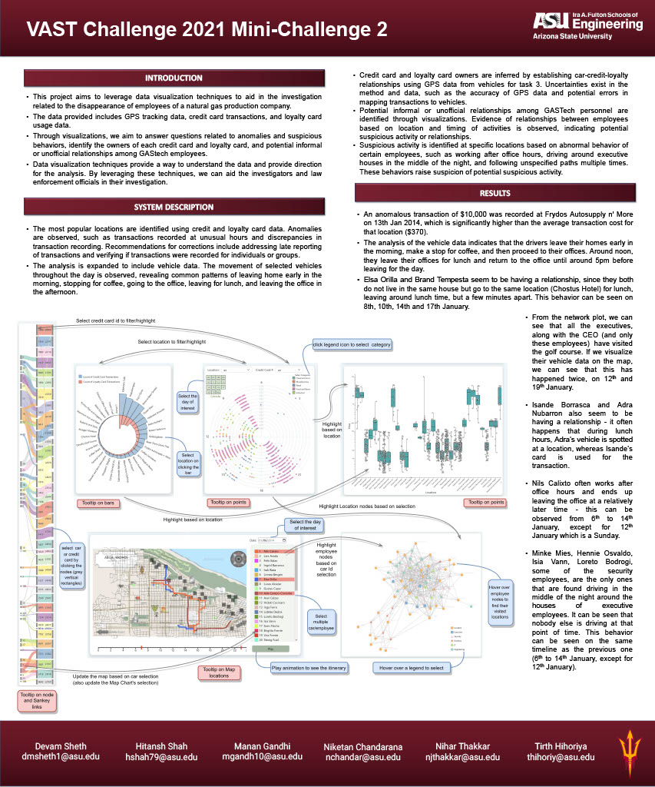

# Project: VAST Challenge 2021 MC-2
### Hosted Website : https://devamsheth21.github.io/Vast-MC2-2021-Data-Visualization-Project/
### Team Members:
- Person 1: Tirth Hihoriya - thihoriy@asu.edu
- Person 2: Nihar Thakkar - njthakkar@asu.edu
- Person 3: Hitansh Shah - hshah79@asu.edu
- Person 4: Devam Sheth - dmsheth1@asu.edu
- Person 5: Manan Gandhi - mgandh10@asu.edu
- Person 6: Niketan Chandarana - nchandar@asu.edu

### Installing and running code in local machine

- First clone the git repository by running `git clone https://github.com/devamsheth21/Vast-MC2-2021-Data-Visualization-Project.git` command using git bash or terminal.

- Go the the repository folder by running :
 `cd Vast-MC2-2021-Data-Visualization-Project`

- Start a simple Python server by running the command `python -m http.server`. Note: Python should be installed to run this command.

- Open a Firefox browser window and go to `localhost:8000`.
### Poster

### [Project Report](https://docs.google.com/document/d/1_R_ygCEY0ZkCn-aUuypwIZvURobctY-NOcmI_ee9_N0/edit?usp=sharing)
###  
 
 
 
 

### [Video Presentation](https://drive.google.com/file/d/1ShsXpQhaQAEpjstM8Eht4vvEjHzT0WDv/view?usp=sharing)
